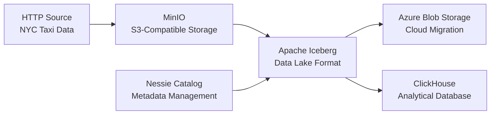

# 🚀 Data Ingestion Pipeline: HTTP → MinIO → Iceberg → Azure → ClickHouse

A comprehensive data engineering pipeline that demonstrates modern data ingestion, migration, and storage patterns using industry-standard tools and cloud platforms.


## 📋 Project Overview

This project implements a complete **data ingestion pipeline** that processes NYC taxi trip data through multiple storage formats and cloud platforms. The pipeline showcases best practices in data engineering, including:

- **Data Ingestion**: HTTP → Parquet files
- **Object Storage**: MinIO (S3-compatible)
- **Data Lake Format**: Apache Iceberg with Nessie catalog
- **Cloud Migration**: Azure Blob Storage
- **Analytical Database**: ClickHouse

## 🏗️ Architecture



## 📄 Project Structure

```
FrameworksProyecto1/
├── docker-compose.yml          # Service orchestration
├── dlt/
│   └── secrets.toml           # Configuration secrets
├── notebooks/
│   ├── 1.http-to-bucket.ipynb      # HTTP → MinIO ingestion
│   ├── 2.parquet-to-iceberg.ipynb  # Parquet → Iceberg conversion
│   ├── 3.minio-to-azure.ipynb      # MinIO → Azure migration
│   └── 4.iceberg-to-clickhouse.ipynb # Iceberg → ClickHouse ingestion
└── README.md                   # This file
```

## 🛠️ Technology Stack

| Component | Technology | Purpose |
|-----------|------------|---------|
| **Data Pipeline** | DLT (Data Load Tool) | Data ingestion orchestration |
| **Object Storage** | MinIO | S3-compatible storage |
| **Data Lake** | Apache Iceberg | ACID transactions, schema evolution |
| **Catalog** | Nessie | Metadata management |
| **Cloud Storage** | Azure Blob Storage | Cloud data lake |
| **Analytics DB** | ClickHouse | OLAP database |
| **Containerization** | Docker Compose | Service orchestration |
| **Notebooks** | Jupyter Lab | Interactive development |

## 📊 Data Ingestion Pipeline Stages

### Stage 1: HTTP to MinIO (`1.http-to-bucket.ipynb`)
- **Source**: NYC taxi trip data from public URL
- **Target**: MinIO bucket in Parquet format
- **Process**: Direct HTTP download → DLT pipeline → S3-compatible storage
- **Duration**: ~1.2 seconds

### Stage 2: Parquet to Iceberg (`2.parquet-to-iceberg.ipynb`)
- **Source**: Parquet files in MinIO
- **Target**: Iceberg table with Nessie catalog
- **Process**: Schema conversion → Iceberg table creation → Data append
- **Features**: Schema evolution, ACID transactions, metadata tracking

### Stage 3: MinIO to Azure (`3.minio-to-azure.ipynb`)
- **Source**: Iceberg table in MinIO
- **Target**: Azure Blob Storage (ADLS)
- **Process**: Iceberg scan → DLT pipeline → Azure migration
- **Duration**: ~1 minute 38 seconds

### Stage 4: Iceberg to ClickHouse (`4.iceberg-to-clickhouse.ipynb`)
- **Source**: Iceberg table in MinIO
- **Target**: ClickHouse analytical database
- **Process**: Iceberg scan → DLT pipeline → ClickHouse ingestion
- **Duration**: ~2.9 seconds
- **Records**: 3,475,226 taxi trips

## 🚀 Quick Start

### Prerequisites
- Docker and Docker Compose
- Python 3.8+
- Azure Storage Account (for cloud migration)

### 1. Clone and Setup
```bash
git clone https://github.com/caroldvarela/http-minio-iceberg-azure-clickhouse.git
cd http-minio-iceberg-azure-clickhouse
```

### 2. Configure Secrets
Update `dlt/secrets.toml` with your Azure credentials:
```toml
[s3_to_adls.destination.filesystem]
bucket_url = "abfss://<YOUR_CONTAINER_NAME>@<YOUR_ACCOUNT_NAME>.dfs.core.windows.net/<YOUR_FOLDER>"

[s3_to_adls.destination.filesystem.credentials]
azure_storage_account_name = "<YOUR_AZURE_ACCOUNT_NAME>"
azure_storage_account_key = "<YOUR_AZURE_ACCOUNT_KEY>"
```

### 3. Start Services
```bash
docker-compose up -d
```

### 4. Access Jupyter Lab
- **URL**: http://localhost:8888
- **No authentication required** (development setup)

### 5. Run Data Ingestion Pipeline
Execute notebooks in sequence:
1. `1.http-to-bucket.ipynb`
2. `2.parquet-to-iceberg.ipynb`
3. `3.minio-to-azure.ipynb`
4. `4.iceberg-to-clickhouse.ipynb`

## 🔧 Service Endpoints

| Service | URL | Purpose |
|---------|-----|---------|
| **Jupyter Lab** | http://localhost:8888 | Interactive development |
| **MinIO Console** | http://localhost:9001 | Object storage management |
| **MinIO API** | http://localhost:9000 | S3-compatible API |
| **Nessie Catalog** | http://localhost:19120 | Iceberg metadata |
| **ClickHouse HTTP** | http://localhost:8123 | Database queries |

## 📈 Performance Metrics

| Stage | Duration | Data Volume | Records |
|-------|----------|-------------|---------|
| HTTP → MinIO | 1.2s | ~50MB | 3,475,226 |
| Parquet → Iceberg | <1s | Schema mapping | 3,475,226 |
| MinIO → Azure | 1m 38s | Cloud migration | 3,475,226 |
| Iceberg → ClickHouse | 2.9s | Database ingestion | 3,475,226 |

## 🔍 Data Schema

The NYC taxi dataset contains 19 columns:

| Column | Type | Description |
|--------|------|-------------|
| `vendor_id` | int32 | Taxi vendor identifier |
| `tpep_pickup_datetime` | timestamp | Pickup time |
| `tpep_dropoff_datetime` | timestamp | Dropoff time |
| `passenger_count` | double | Number of passengers |
| `trip_distance` | double | Trip distance in miles |
| `ratecode_id` | double | Rate code |
| `store_and_fwd_flag` | string | Store and forward flag |
| `pu_location_id` | int32 | Pickup location ID |
| `do_location_id` | int32 | Dropoff location ID |
| `payment_type` | int64 | Payment method |
| `fare_amount` | double | Base fare amount |
| `extra` | double | Extra charges |
| `mta_tax` | double | MTA tax |
| `tip_amount` | double | Tip amount |
| `tolls_amount` | double | Tolls amount |
| `improvement_surcharge` | double | Improvement surcharge |
| `total_amount` | double | Total trip amount |
| `congestion_surcharge` | double | Congestion surcharge |
| `airport_fee` | double | Airport fee |
| `cbd_congestion_fee` | double | CBD congestion fee |

## 📚 Learning Outcomes

This project demonstrates proficiency in:

- **Modern Data Stack**: DLT, Iceberg, ClickHouse
- **Cloud Platforms**: Azure Blob Storage
- **Containerization**: Docker services
- **Data Formats**: Parquet, Iceberg tables
- **Data Ingestion Patterns**: Extract, Load, Migrate
- **Metadata Management**: Catalog systems

## 🔧 Troubleshooting

### Service Health Checks
```bash
# Check all services
docker-compose ps

# View service logs
docker-compose logs <service-name>

# Restart specific service
docker-compose restart <service-name>
```


